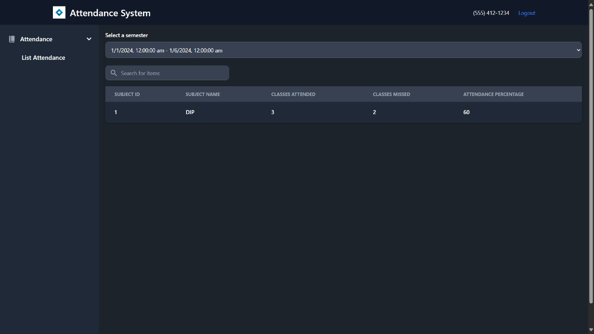

# Facial Recognition Based Attendance System

## Installation
```shell
$ cd face_recognition
$ pip install -r requirements.txt
$ cd ../server
$ pip install -r requirements.txt
$ cd client
$ npm install
```

## Running
### Running Uvicorn Server
```shell
$ cd server
$ uvicorn server:app
```
### Running Node Server
```shell
$ cd server/client
$ npm run serve
```

now the server is running at localhost:4000

### Running Face Recognition for Marking Attendance
```shell
$ cd face_recognition
$ python Driver.py
```

## Screenshots

|  |  |
---| --
|  |  |
|  |   |
| |  |
|  |  |